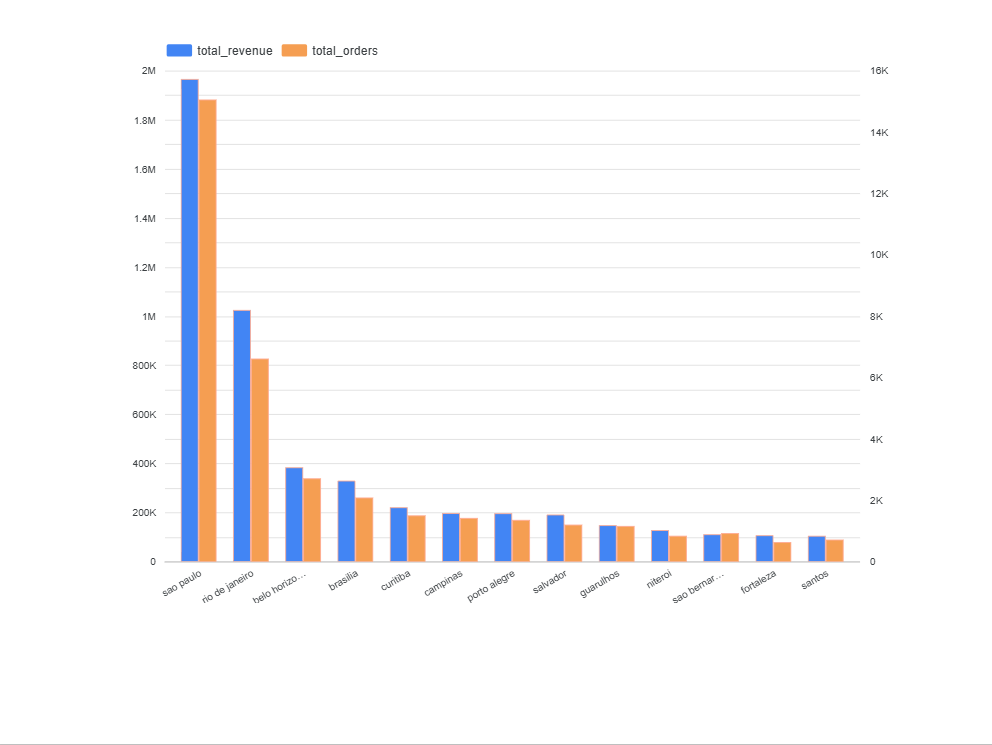
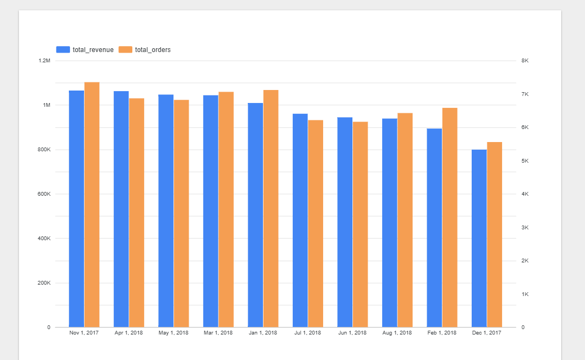
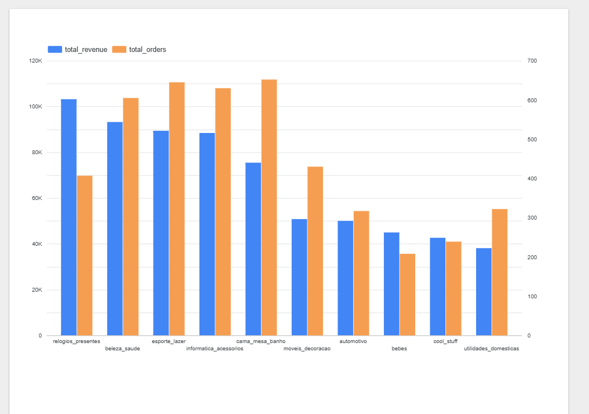

#  🛒Ecommerce Analytics Data Warehouse (BigQuery) 

This project demonstrates an end-to-end analytics engineering workflow using Google Cloud Storage (GCS) for storing raw files and BigQuery as the data warehouse. The pipeline follows a Bronze → Silver → Gold medallion architecture, with SQL-first transformations applied within BigQuery and Looker studio for data visualization.

## 🧱Architecture Overview

## 🟤Bronze Layer — Raw Data Ingestion

 The Bronze layer is responsible for landing raw source data into the data warehouse with no transformation.

### Details:

Source data consists of e-commerce CSV files including customers, products, orders, and order_items.

Raw CSV files are manually uploaded to Google Cloud Storage (GCS).

The files are then imported into BigQuery Bronze tables to serve as the initial landing zone.

### Architecture:

The warehouse follows a Medallion architecture with separate datasets for each layer:

bronze – Raw ingested data

silver – Cleaned and standardized data

gold – Business-ready analytical tables

### Ingestion Approach:

Raw CSV files are first stored in Google Cloud Storage.

The files are then loaded into BigQuery Bronze tables with minimal processing.

Table structures closely match the source files to preserve the original data format.

### Key Principle:

Bronze tables act as a raw data landing zone and are treated as immutable.
No business logic, filtering, or transformations are applied at this stage to ensure the original source data remains intact.

## 🥈 Silver Layer — Data Cleaning & Modeling (SQL)

 ### Objective:

Prepare analytics-ready tables by enforcing data quality and business rules.

### Transformations applied:

- Removed duplicate records using SELECT DISTINCT.

- Filtered orders to include only delivered orders.

- Standardized date fields for consistent time-based analysis.

- Enforced referential integrity:

    - Dropped orphan order_items records using joins against valid orders.

- Handled key consistency issues by applying TRIM() on join columns to prevent false mismatches.

### Silver tables created:

* silver.customers

* silver.products

* silver.orders

* silver.order_items   

### Key principle:

Silver layer enforces business correctness, not just null handling.

All transformations are implemented using pure SQL.

## 🟡 Gold Layer — Analytical Metrics (SQL)

### Objective:

Create business-ready, aggregated tables for reporting and analysis.

### Gold metrics implemented:

- ### Monthly Revenue Metrics

    - Total revenue
    - Total orders

- ### City-Level Monthly Metrics

    - Active users
    - Revenue
    - Order volume

- ### Category-Level Monthly Revenue

    - Revenue and order trends by product category

- ### Customer Lifetime Value (CLV)

    - Total revenue per customer
    - Order count
    - First and last purchase dates

Gold objects are created as tables/views under the gold schema and are designed to be directly consumable by BI tools.

## 📈 Looker Studio Visualization

- City wise revenue and orders

! 

- Monthly revenue and orders with product category drill down

 

### 🛠 Tech Stack

Storage: Google Cloud Storage(GCS)

Warehouse: BigQuery

Transformation: Dataform

Languages: SQL

Architecture: Bronze–Silver–Gold (Medallion Architecture)

Version Control: Git & GitHub

### 📌 Key Learnings

- Demonstrated how cloud tools like Google Cloud Storage (GCS) and BigQuery can be integrated to build a scalable analytics pipeline using a Medallion (Bronze → Silver → Gold) architecture.

- Built analytics-ready datasets suitable for reporting and dashboards.

